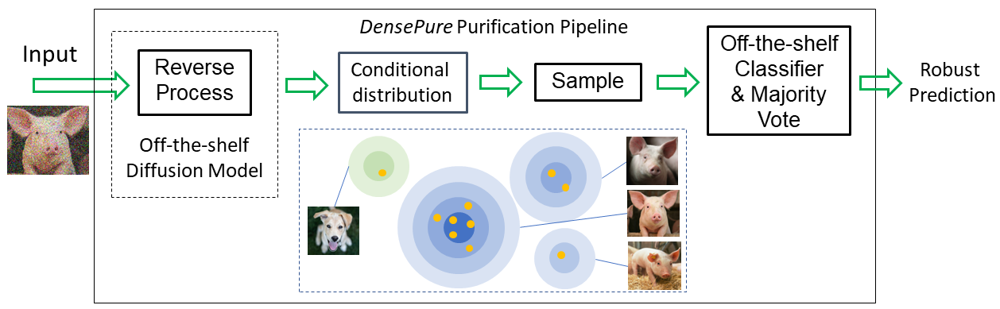

# DensePure: Understanding Diffusion Models towards Adversarial Robustness

<p align="center">
  
</p>

Official PyTorch implementation of the paper:<br>
**[DensePure: Understanding Diffusion Models towards Adversarial Robustness](https://arxiv.org/abs/2211.00322)**
<br>
Chaowei Xiao, Zhongzhu Chen, Kun Jin, Jiongxiao Wang, Weili Nie, Mingyan Liu, Anima Anandkumar, Bo Li, Dawn Song<br>
https://densepure.github.io <br>

Abstract: *Diffusion models have been recently employed to improve certified robustness through the process of denoising. However, the theoretical understanding of why diffusion models are able to improve the certified robustness is still lacking, preventing from further improvement. In this study, we close this gap by analyzing the fundamental properties of diffusion models and establishing the conditions under which they can enhance certified robustness. This deeper understanding allows us to propose a new method DensePure, designed to improve the certified robustness of a pretrained model (i.e. classifier). Given an (adversarial) input, DensePure consists of multiple runs of denoising via the reverse process of the diffusion model (with different random seeds) to get multiple reversed samples, which are then passed through the classifier, followed by majority voting of inferred labels to make the final prediction. This design of using multiple runs of denoising is informed by our theoretical analysis of the conditional distribution of the reversed sample. Specifically, when the data density of a clean sample is high, its conditional density under the reverse process in a diffusion model is also high; thus sampling from the latter conditional distribution can purify the adversarial example and return the corresponding clean sample with a high probability. By using the highest density point in the conditional distribution as the reversed sample, we identify the robust region of a given instance under the diffusion model's reverse process. We show that this robust region is a union of multiple convex sets, and is potentially much larger than the robust regions identified in previous works. In practice, DensePure can approximate the label of the high density region in the conditional distribution so that it can enhance certified robustness. We conduct extensive experiments to demonstrate the effectiveness of DensePure by evaluating its certified robustness given a standard model via randomized smoothing. We show that DensePure is consistently better than existing methods on ImageNet, with 7% improvement on average.* 

## Requirements

- Python 3.8.5
- CUDA=11.1, PyTorch=1.8.0
- Installation of required packages:
    ```bash
    pip install -r requirements.txt
    ```

## Datasets, Pre-trained Diffusion Models and Classifiers
Before running our code, you need to first prepare two datasets CIFAR-10 and ImageNet. CIFAR-10 will be downloaded automatically.
For ImageNet, you need to download validation images of ILSVRC2012 from https://www.image-net.org/. And the images need to be preprocessed by running the scripts `valprep.sh` from https://raw.githubusercontent.com/soumith/imagenetloader.torch/master/valprep.sh
under validation directory.  

Please change IMAGENET_DIR to your own location of ImageNet dataset in `datasets.py` before running the code.  

For the pre-trained diffusion models, you need to first download them from the following links:  
- [Improved Diffusion](https://github.com/openai/improved-diffusion) for
  CIFAR-10: (`cifar10_uncond_50M_500K.pt`: [download link](https://openaipublic.blob.core.windows.net/diffusion/march-2021/cifar10_uncond_50M_500K.pt))
- [Guided Diffusion](https://github.com/openai/guided-diffusion) for
  ImageNet: (`256x256 diffusion unconditional`: [download link](https://openaipublic.blob.core.windows.net/diffusion/jul-2021/256x256_diffusion_uncond.pt))

For the pre-trained classifiers, ViT-B/16 model on CIFAR-10 will be automatically downloaded by `transformers`.  For ImageNet BEiT large model, you need to dwonload from the following links:
- [BEiT](https://github.com/microsoft/unilm/tree/master/beit) for
  ImageNet: (`beit_large_patch16_512_pt22k_ft22kto1k.pth`: [download link](https://conversationhub.blob.core.windows.net/beit-share-public/beit/beit_large_patch16_512_pt22k_ft22kto1k.pth))

Please place all the pretrained models in the `pretrained` directory. If you want to use your own classifiers, code need to be changed in `eval_certified_densepure.py`.

## Run Experiments of Carlini 2022
We provide our own code implementation for the paper [(Certified!!) Adversarial Robustness for Free!](https://arxiv.org/abs/2206.10550) to compare with DensePure.  

To gain the results in Table 1 about Carlini22, please run the following scripts using different noise levels `sigma`: 
```
cd run_scripts
bash carlini22_cifar10.sh [sigma] # For CIFAR-10
bash carlini22_imagenet.sh [sigma]  # For ImageNet
```

## Run Experiments of DensePure
To get certified accuracy under DensePure, please run the following scripts:
```
cd run_scripts
bash densepure_cifar10.sh [sigma] [steps] [reverse_seed] # For CIFAR-10
bash densepure_imagenet.sh [sigma] [steps] [reverse_seed] # For ImageNet
```

Note: `sigma` is the noise level of randomized smoothing. `steps` is the parameter for fast sampling steps in Section 5.2 and it must be larger than one and smaller than the total reverse steps. `reverse_seed` is a parameter which control majority vote process in Section 5.2. For example, you need to run `densepure_cifar10.sh` 10 times with 10 different `reverse_seed` to finish 10 majority vote numbers experiments. After running above scripts under one `reverse_seed`, you will gain a `.npy` file that contains labels of 100000 (for CIFAR-10) randomized smoothing sampling times. If you want to obtain the final results of 10 majority vote numbers, you need to run the following scripts in `results` directory:
```
cd results
bash merge_cifar10.sh [sigma] [steps] [majority_vote_numbers] # For CIFAR-10
bash merge_imagenet.sh [sigma] [steps] [majority_vote_numbers] # For ImageNet
```

## Citation
Please cite our paper and Carlini et al. (2022), if you happen to use this codebase:
```
@article{xiao2022densepure,
  title={DensePure: Understanding Diffusion Models towards Adversarial Robustness},
  author={Xiao, Chaowei and Chen, Zhongzhu and Jin, Kun and Wang, Jiongxiao and Nie, Weili and Liu, Mingyan and Anandkumar, Anima and Li, Bo and Song, Dawn},
  journal={arXiv preprint arXiv:2211.00322},
  year={2022}
}
```

```
@article{carlini2022certified,
  title={(Certified!!) Adversarial Robustness for Free!},
  author={Carlini, Nicholas and Tramer, Florian and Kolter, J Zico and others},
  journal={arXiv preprint arXiv:2206.10550},
  year={2022}
}
```